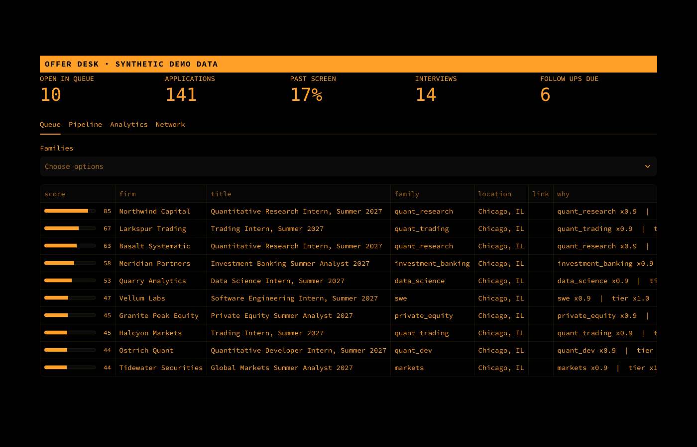
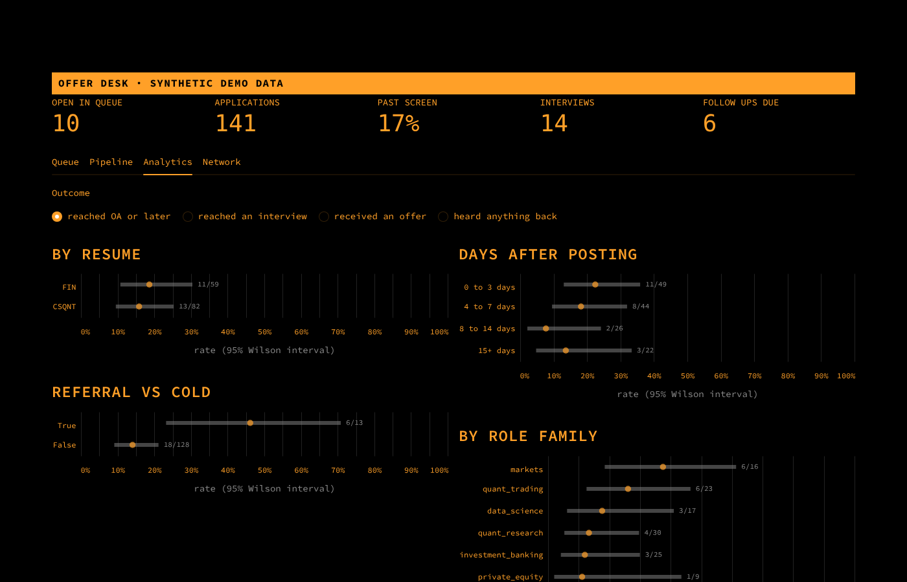

# Offer Desk

Run your internship search like a trading desk. Source postings straight from company job boards, rank them against your own priorities, route each one to the right resume, and measure what actually converts, with honest error bars.



## Why

A quant or finance internship search is a few hundred applications, a handful of responses, and almost no feedback about why. Most tools optimize for volume. Offer Desk optimizes for signal.

It answers three questions every morning.

1. Which open postings deserve my time today, and why?
2. Which version of my resume should each one get?
3. Is anything I am doing actually working, or is it noise?

The third question is the interesting one. With 100 applications and a 15% response rate, the difference between two resumes is usually inside the margin of error. Offer Desk says so instead of pretending otherwise.

## What it does

**Sourcing.** Pulls live postings from the public JSON APIs behind Greenhouse, Lever, and Ashby boards. No browser, no scraping, no login. Firms on Workday or their own sites can be logged by hand so they still flow through routing and analytics.

**Scoring.** Each posting gets a 0 to 100 score that is a product of interpretable factors.

```
score = 100 × family weight × firm tier × seniority × cycle fit × location fit × freshness
```

A product means one dealbreaker (a PhD only role, the wrong graduation year) sinks a posting on its own. Freshness decays with a configurable half life because good postings fill fast. Every factor is stored, so the queue always explains itself.

**Resume routing.** Two resume variants, finance framed and quant framed. A rules layer adds keyword evidence in log odds space starting from a role family prior, so it works on day one. After 20 logged applications a TF IDF and logistic regression layer trains on your own decisions and is blended in, weighted by n / (n + 50). Every recommendation comes with a confidence and the evidence behind it, and overriding it is logged so the router audit can tell you whether your overrides help.

**Letter drafts.** Short cover letters for application text boxes, stitched only from sentences you wrote in `config/profile.yaml`. It never adds claims about you.

**Referral tracking.** Contacts live next to applications. `contact due` shows conversations that went quiet, and `contact coverage` shows target firms where you do not know anyone yet.

**Analytics.**

| Question | Method |
| --- | --- |
| What fraction got past the resume screen? | Wilson score intervals, which behave well at small n and near 0 |
| Does resume A beat resume B? Do referrals help? | Fisher's exact test, plus a Beta Binomial posterior giving P(A better) and a credible interval on the difference |
| How long until I hear back? | Kaplan Meier survival curve. Applications with no reply yet are right censored, not counted as rejections |
| Does applying early matter? | Conversion by days after posting, with intervals |



*Screenshots use synthetic demo data with fictional firms (`offerdesk demo`).*

## Quick start

```bash
git clone https://github.com/KoushikChikku11/offer-desk.git
cd offer-desk
pip install -e ".[dashboard,dev]"

offerdesk init        # creates config/settings.yaml and config/profile.yaml (both gitignored)
offerdesk probe       # checks which ATS board slugs in config/firms.yaml are live
offerdesk sync        # pulls and scores postings
offerdesk queue       # best open postings first
```

Then edit `config/profile.yaml` in your own words and drop your resumes in `resumes/` (also gitignored).

Want to see the dashboard before you have any history?

```bash
offerdesk demo
streamlit run app.py -- --db data/demo.db
```

## Daily loop

```bash
offerdesk sync                          # what's new
offerdesk queue -n 15
offerdesk show 4907430101 --letter      # score breakdown, resume pick, contacts there, draft letter
offerdesk apply 4907430101              # logs it with the router's pick (override with --resume FIN)
offerdesk add --firm Citadel --title "Quantitative Research Intern" --days-after-posting 2
offerdesk log 12 oa                     # oa | interview | final | offer | rejected | withdrawn
offerdesk contact add --name "Jordan Lee" --firm DRW --relationship alum
offerdesk contact due
offerdesk stats                         # funnel, segments, A vs B tests, time to reply
streamlit run app.py
```

## Configuration

| File | Committed | What it holds |
| --- | --- | --- |
| `config/firms.yaml` | yes | Firms, ATS provider, board slug, tier, and whether `probe` verified the slug |
| `config/settings.yaml` | no | Graduation year, locations, skip keywords, family weights, scoring knobs |
| `config/profile.yaml` | no | Your pitch and "why this role" sentences for letter drafts |
| `data/offerdesk.db` | no | SQLite database of postings, applications, events, and contacts |

Your personal data never leaves your machine. Change `family_weights` to encode your own priorities, then run `offerdesk rescore`.

## Project layout

```
src/offerdesk/
  sources/        greenhouse.py, lever.py, ashby.py  (fetch and normalize)
  scoring.py      family classification and the multiplicative score
  pipeline.py     sync and rescore
  router.py       rules plus learned resume routing
  letters.py      letter drafts from your own text
  analytics.py    Wilson, Fisher, Beta Binomial, Kaplan Meier, router audit
  network.py      referral follow ups and firm coverage
  db.py           SQLite schema and queries
  cli.py          command line interface
  demo.py         synthetic data with fictional firms
app.py            Streamlit dashboard
tests/            pytest suite with fixtures shaped like real board responses
```

## Design choices

**Applying stays manual.** Offer Desk decides where to spend effort. You still read the posting and click submit. That keeps every application something you would stand behind and keeps the tool out of anyone's spam filters.

**Small data, stated plainly.** The dashboard leads with intervals, not point estimates. A 6/13 referral rate gets a wide band and a "not distinguishable yet" label until the data earns a stronger claim.

**Explainable over clever.** The scoring model is a product of named factors you can read and tune. The router shows its evidence. Nothing is a black box you have to trust.

## Roadmap

1. Train the router on outcomes (did this resume pass the screen?) instead of only on past choices, once there is enough history to avoid overfitting.
2. Hierarchical model for conversion by firm, pooling toward the family rate so firms with two applications do not get extreme estimates.
3. Scheduled sync with a short daily digest of new high scoring postings.
4. Deadline and closing date tracking for postings that publish them.

## Credit

The idea of sourcing straight from ATS JSON instead of browsers was inspired by [alecswang/please-hire-me](https://github.com/alecswang/please-hire-me), an agent that fills out applications automatically. Offer Desk takes a different direction and focuses on prioritization, resume routing, and measuring outcomes. No code is shared between the projects.

## License

MIT
